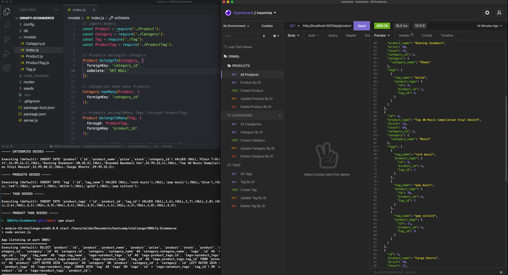

  # ORMify E-commerce
  

  ## Description
  The purpose of this application is to link an existing Express.js API with a database using Sequelize. In all, here are the technologies used:
  - JavaScript
  - Express.js
  - Node.js
  - MySQL
  - Sequelize
  - (demonstration of this product using Insomnia Core)  

  ## Table of Contents
  * [Installation](#installation)
  * [Usage](#usage)
  * [Credits](#credits)
  * [License](#license)
  * [Contributing](#contributing)
  * [Tests](#tests)
  * [Questions](#questions)
  
  ## Installation
  Use the command 'git clone' in your command line with the link of this repo while navigated to your desired directory to copy this repo to your machine, run 'npm install' or 'npm i' in your command line in the root folder of this application to install dependencies required (mysql2, sequelize, express, dotenv). (note: it is not recommended to update the version of these dependencies, in order to ensure maximum compatability)

  ## Usage
  1. To use your own mysql database with this program, make sure you create a .env file and include your mysql database usage and credentials. 
  2. In your command line while in the root folder of the application, login to the mysql shell using the command 'mysql -u root -p'. If you are using a different mysql user specify that in place of root. You'll insert your password after executing this command.
  3. Run the command 'SOURCE db/schema.sql' to start with a fresh database. 
  4. Exit the mysql shell using 'quit;' 
  5. While still in the application root folder, run the command 'npm run seed' to seed your database with table data from the application.
  6. Run the command 'npm start' to initialize the server.
  7. Using insomnia, or some other visual server API route GUI, you can run any of the routes listed in the route folders using the corresponding api address beginning with http://localhost:3001/api/

  ### Deployed link and Screenshots
  (no deployed application, runs through node on local machine)
  
  

  ## Credits
  the user guidelines and starter code for this project were given by Trilogy Education as a part of the University of Kansas Full Stack Web Developer Bootcamp. © 2021 Trilogy Education Services, LLC, a 2U, Inc. brand. Confidential and Proprietary. All Rights Reserved.

  ## License
  
  
### MIT LICENSE

Permission is hereby granted, free of charge, to any person obtaining a copy
of this software and associated documentation files (the "Software"), to deal
in the Software without restriction, including without limitation the rights
to use, copy, modify, merge, publish, distribute, sublicense, and/or sell
copies of the Software, and to permit persons to whom the Software is
furnished to do so, subject to the following conditions:

The above copyright notice and this permission notice shall be included in all
copies or substantial portions of the Software.

THE SOFTWARE IS PROVIDED "AS IS", WITHOUT WARRANTY OF ANY KIND, EXPRESS OR
IMPLIED, INCLUDING BUT NOT LIMITED TO THE WARRANTIES OF MERCHANTABILITY,
FITNESS FOR A PARTICULAR PURPOSE AND NONINFRINGEMENT. IN NO EVENT SHALL THE
AUTHORS OR COPYRIGHT HOLDERS BE LIABLE FOR ANY CLAIM, DAMAGES OR OTHER
LIABILITY, WHETHER IN AN ACTION OF CONTRACT, TORT OR OTHERWISE, ARISING FROM,
OUT OF OR IN CONNECTION WITH THE SOFTWARE OR THE USE OR OTHER DEALINGS IN THE
SOFTWARE.

  ## Contributing
  No contributing guidelines currently

  ## Tests
  No tests at this time

  ## Questions
  You can find my GitHub profile at https://github.com/bgswilde
  For any further questions, reach out to me via email at bgswilde@gmail.com.
